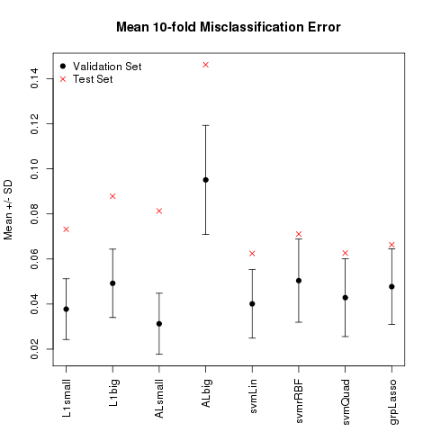

Assessing sparsity through a simulation study
========================================================
autosize: true  
transition-speed: slow
  
Kevin Cummiskey, Caleb Lareau, Matthew Ploenzke 
BST235-- Advanced Regression and Statistical Learning

https://bit.ly/KCMbst235</a> December 12, 2016

Introduction
========================================================
 
Goal
- Investigate sparsity through simulated gene sets
      - Group sparsity and correlation
      - Sparse coefficients versus sparse support vectors
      - Point estimate bias
      - Assess Prediction 
 
Plan
- Consider various regularized linear and nonlinear models 
      - Lasso, Adaptive Lasso, SVM
- Consider both a linear and nonlinear underlying data-generating mechanism 
- Consider gene sets with varying levels of correlation
- Consider gene sets with varying levels of effect size

Models
========================================================
 
- LASSO
$$\hat{\beta}_{lasso} = \min_\beta \left\{ \left|\left|Y - X\beta\right|\right|^2 + \lambda \sum_{j = 1}^{p} \left|\beta_j\right| \right\}$$
- Adaptive LASSO
$$\hat{\beta}_{Alasso} = \min_\beta \left\{ \left|\left|Y - X\beta\right|\right|^2 + \lambda \sum_{j = 1}^{p} w_j\left|\beta_j\right| \right\} \qquad w_j = \left|1/\hat{\beta}_j\right|^v$$
- Support Vector Machine
$$\hat{\beta}_{svm} = \min_\beta \left\{ \sum_{i=1}^N \left[1-y_i f(x_i) \right]_+ + \frac{\lambda}{2}\left|\left|\beta\right|\right| \right\}$$

Models - Key Properties
========================================================
 
- LASSO
  - estimates not asymptotically normal
  - biased estimates for large parameters
  - bootstrap fails

- Adaptive LASSO
  - estimates asymptically normal
  - less bias for large parameter estimates
  - oracle property 
 
***
- Support Vector Machine
  - constructs optimal hyperplanes in transformed spaces
  - boundary determined by points near boundary (support vectors)
  
Gene set correlation
========================================================
 
- Caleb could on the fly simulate this and demonstrate the app
- N=500, p = 5 "super-gene" sets of 5 genes defined with correlation structure...
- discuss linear vs nonlinear data generating mechanism

Predictor sparsity
========================================================
 
- heatmap under lasso vs group lasso varying effect size - caleb
- again could be done outside the presentation to take up time

Predictor sparsity
========================================================
 
- heatmap under lasso vs group lasso varying correlation - caleb

Lasso - No interaction effects
========================================================

<figcaption>Linear</figcaption>

<figcaption>Nonlinear</figcaption>

Lasso - Interaction effects
========================================================

<figcaption>Linear</figcaption>

<figcaption>Nonlinear</figcaption>

Adaptive Lasso - No interaction effects
========================================================

<figcaption>Linear</figcaption>

<figcaption>Nonlinear</figcaption>

Adaptive Lasso - Interaction effects
========================================================

<figcaption>Linear</figcaption>

<figcaption>Nonlinear</figcaption>

Group Lasso - no interaction effects
========================================================

<figcaption>Linear</figcaption>

<figcaption>Linear</figcaption>

<figcaption>Nonlinear</figcaption>

<figcaption>Nonlinear</figcaption>

SVM linear kernel
========================================================

<figcaption>Linear</figcaption>

<figcaption>Nonlinear</figcaption>

SVM Quadratic kernel
========================================================

<figcaption>Linear</figcaption>

<figcaption>Nonlinear</figcaption>

SVM Gaussian kernel
========================================================

<figcaption>Linear</figcaption>

<figcaption>Nonlinear</figcaption>

Importance of parameter tuning
========================================================

<figcaption>Offset=1000</figcaption>

<figcaption>Offset=0</figcaption>

Model comparison
========================================================

<figcaption>Linear</figcaption>

<figcaption>Nonlinear</figcaption>

SVM sparsity - Linear kernel
========================================================

<figcaption>Linear</figcaption>

<figcaption>Nonlinear</figcaption>

SVM sparsity - Quadratic kernel
========================================================

<figcaption>Linear</figcaption>

<figcaption>Nonlinear</figcaption>

SVM sparsity - Gaussian kernel
========================================================

<figcaption>Linear</figcaption>

<figcaption>Nonlinear</figcaption>

Point estimate bias
========================================================
 
- bootstrap confidence intervals table - kevin

Conclusion
========================================================
 
- Group sparsity resolved under group lasso but not lasso
- L2 loss + L1 regularization = sparse coefficients
- Hinge loss + L1 regularization = sparse support vectors
- Lasso point estimates are biased and Adaptive lasso resolves this for large effect sizes
- The data generating mechanism is important for model specification

Thanks!
======================================================== 

