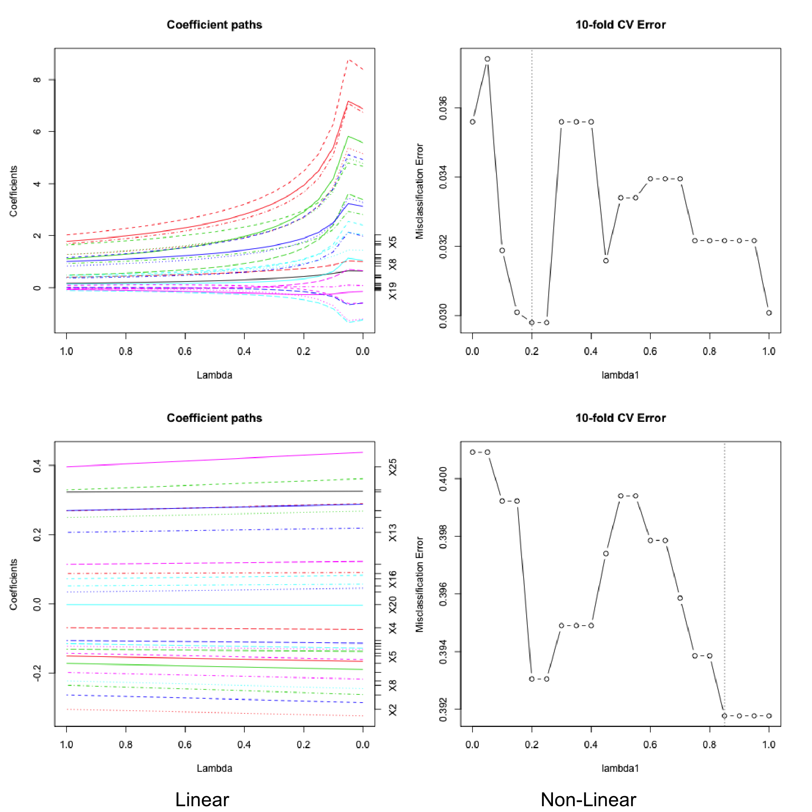

Assessing sparsity through a simulation study
========================================================
transition-speed: slow
width: 1920
height: 1080
  
Kevin Cummiskey, Caleb Lareau, Matthew Ploenzke 
BST235-- Advanced Regression and Statistical Learning

bit.ly/KCMbst235</a> December 12, 2016

Overview
========================================================
 
- Investigate sparsity through simulated gene sets
      - Group sparsity and correlation
      - Sparse coefficients versus sparse support vectors
      - Point estimate bias
      - Assess Prediction 
         
- Consider various regularized linear and nonlinear models 
      - Lasso, Adaptive Lasso, SVM
- Consider both a linear and nonlinear underlying data-generating mechanism 
- Simulate gene sets with varying levels of correlation/effect sizes

 
========================================================
LASSO  
  - estimates not asymptotically normal
  - biased estimates for large parameters
  - bootstrap fails   
$$\hat{\beta}_{lasso} = \min_\beta \left\{ \left|\left|Y - X\beta\right|\right|^2 + \lambda \sum_{j = 1}^{p} \left|\beta_j\right| \right\}$$   

  
Group LASSO  
  - estimates not asymptotically normal, biased
  - adds L1-L2 penalty to impose grouping   
$$\scriptsize \hat{\beta}_{group} = \min_\beta \left\{ \left|\left|Y - X\beta\right|\right|^2 + \lambda \sum_{j = 1}^{p} \left| \left|\beta_j\right|\right|_{G_j} \right\}$$  

  
 
========================================================
Adaptive LASSO
  - estimates asymptically normal
  - decreasing bias for increasing parameter estimates
  - oracle property   
$$\scriptsize \hat{\beta}_{Alasso} = \min_\beta \left\{ \left|\left|Y - X\beta\right|\right|^2 + \lambda \sum_{j = 1}^{p} w_j\left|\beta_j\right| \right\} \qquad w_j = \left|1/\hat{\beta}_j\right|^v$$  

Support Vector Machine
  - constructs optimal hyperplanes in transformed spaces
  - boundary determined by points near boundary (support vectors)  
$$\scriptsize \hat{\beta}_{svm} = \min_\beta \left\{ \sum_{i=1}^N \left[1-y_i f(x_i) \right]_+ + \frac{\lambda}{2}\left|\left|\beta\right|\right| \right\}$$

Interactive Demo
========================================================

Lasso - Linear Data Generation
========================================================
   

<figcaption>Linear Model Specification</figcaption>

***
   

<figcaption>Nonlinear Model Specification</figcaption>

Lasso - Non-Linear Data Generation
========================================================
   

<figcaption>Linear Model Specification</figcaption>

***
   

<figcaption>Nonlinear Model Specification</figcaption>

Group Lasso - Linear Model Specification 
========================================================
 

SVM linear kernel
========================================================
  

<figcaption>(Linear Data Simulation)</figcaption>

***
  

<figcaption>(Nonlinear Data Simulation)</figcaption>

SVM sparsity - Linear kernel
========================================================
  

<figcaption>(Linear Data Simulation)</figcaption>

***
  

<figcaption>(Nonlinear Data Simulation)</figcaption>

SVM Quadratic kernel
========================================================
  

<figcaption>(Linear Data Simulation)</figcaption>

***
  

<figcaption>(Nonlinear Data Simulation)</figcaption>

SVM sparsity - Quadratic kernel
========================================================
  

<figcaption>(Linear Data Simulation)</figcaption>

***
  

<figcaption>(Nonlinear Data Simulation)</figcaption>

SVM Gaussian kernel
========================================================
  

<figcaption>(Linear Data Simulation)</figcaption>

***
  

<figcaption>(Nonlinear Data Simulation)</figcaption>

SVM sparsity - Gaussian kernel
========================================================
  

<figcaption>(Linear Data Simulation)</figcaption>

***
  

<figcaption>(Nonlinear Data Simulation)</figcaption>

Importance of parameter tuning
========================================================
  

<figcaption>Offset=1000</figcaption>

***
  

<figcaption>Offset=0</figcaption>

Model comparison
========================================================
  

<figcaption>(Linear Data Simulation)</figcaption>

***
  

<figcaption>(Nonlinear Data Simulation)</figcaption>

Bootstrap No Correlation
========================================================
 

Bootstrap Correlated Predictors
========================================================
 

- Bootstrap fails with LASSO

Conclusion
========================================================
 
- Group sparsity resolved under group lasso but not lasso
- L2 loss + L1 regularization = sparse coefficients
- Hinge loss + L1 regularization = sparse support vectors
- Lasso point estimates are biased and Adaptive lasso resolves this for large effect sizes

  
- Underlying data and choice of model is vital for accurate statistical inferences
  - We've created an interactive platform to build intuition

Citations
========================================================
 
[1] Chatterjee, A., and S. N. Lahiri. "Rates of convergence of the adaptive LASSO estimators to the oracle distribution and higher order refinements by the bootstrap." The Annals of Statistics 41.3 (2013): 1232-1259.

[2] Cortes, Corinna, and Vladimir Vapnik. "Support-vector networks." Machine learning 20.3 (1995): 273-297.

[3] Tibshirani, Robert. "Regression shrinkage and selection via the lasso." Journal of the Royal Statistical Society. Series B (Methodological) (1996): 267-288.

[4] Yuan, Ming, and Yi Lin. "Model selection and estimation in regression with grouped variables." Journal of the Royal Statistical Society: Series B (Statistical Methodology) 68.1 (2006): 49-67.

[5] Zou, Hui. "The adaptive lasso and its oracle properties." Journal of the American statistical association 101.476 (2006): 1418-1429.

Thanks
========================================================
